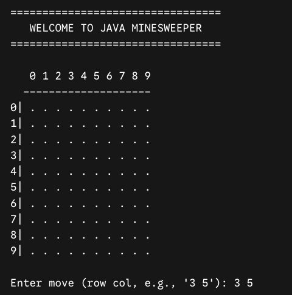

# Minesweeper Game

- A lightweight, terminal-based implementation of the classic Minesweeper game written in Java.
  

## Prerequisites

- Java Development Kit (JDK) version 8 or higher installed on your system.
- A terminal or command prompt window.

## How to play

- ObjectiveReveal all non-mine safe cells on the grid without triggering a mine.

- Game RulesThe Grid: The board is a $10 \times 10$ grid containing 10 hidden mines.

- Symbols:. represents an unrevealed cell.0–8 represents a safe cell and indicates how many mines surround it in the 8 adjacent squares.\* represents a revealed mine.

- Player Moves: Enter coordinates using row and column numbers (0 to 9) separated by a space.

- Game Over:
- Win: Successfully reveal all 90 safe squares.
- Loss: Select a coordinate containing a mine. The console will output "boom!" and reveal all mine locations.

## How to run

run this line on your terminal: java -cp src minesweeper.Main

## Tech stack

- java
